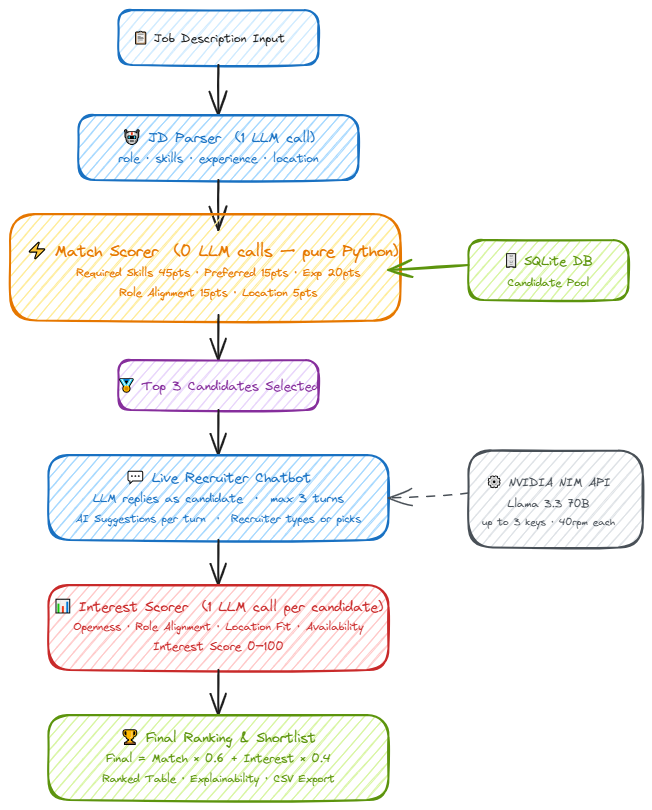

# 🎯 Talent Scout AI
### AI-Powered Talent Scouting & Engagement Agent
> Built for **Catalyst Hackathon** by Deccan AI · Submission by **Arpitha GS**

---

## 🚀 Live Demo
> [https://talent-agent-ai-arpithags.streamlit.app/]

---

## 📌 What It Does

Talent Scout AI automates the full recruiter workflow — from parsing a job description to producing a ranked, explainable shortlist — in one seamless pipeline:

1. JD Parsing — paste any job description, the LLM extracts role, required skills, preferred skills, location, and minimum experience
2. Match Scoring — every candidate in the pool is scored across 5 weighted factors with zero LLM calls (fast, cost-efficient)
3. Top-3 Selection — only the best-matched candidates proceed to the engagement phase
4. Live Recriuter Chatbot — the recruiter types real messages (up to 3 turns); the LLM replies as each candidate based on their actual profile
5. AI Suggestions — 2 context-aware message suggestions per turn (one direct, one warm); click to auto-fill or type your own
6. Interest Scoring — after 3 turns, the LLM analyses the full conversation across 4 dimensions and produces an interest score (0–100)
7. Combined Ranking — final score = 60% Match + 40% Interest, giving recruiters an immediately actionable shortlist with full explainability

---

## 🏗️ Architecture

<p align="center">
  
</p>

<p align="center"><em>End-to-end pipeline from JD input to ranked shortlist</em></p>

---

## ⚙️ Scoring Logic

### Match Score (0–100) — Rule-Based, Zero LLM Calls

| Factor | Weight | Method |
|---|---|---|
| Required Skills | 45 pts | Power-curve ratio `(matched/total)^0.75` — penalises partial matches |
| Preferred Skills | 15 pts | Linear ratio |
| Experience | 20 pts | 3-tier: Full (≥ req) = 20, Partial (req−1) = 14, Miss = 0 |
| Role Alignment | 15 pts | Keyword overlap between JD role title and candidate's current role |
| Location | 5 pts | Exact match = 5, different = 2, no preference = 3 |

### Interest Score (0–100) — LLM-Analysed from Conversation

| Factor | Weight | What It Measures |
|---|---|---|
| Openness | 25 pts | How actively is the candidate looking? |
| Role Alignment | 25 pts | Does this specific role excite them? |
| Location Fit | 25 pts | Are they comfortable with the location? |
| Availability | 25 pts | How soon could they realistically join? |

### Final Combined Score
```
Final = (Match Score × 0.6) + (Interest Score × 0.4)
```
Weight ratio is adjustable via the sidebar slider (0.4–0.8 match weight).

---

## 🛠️ Tech Stack

| Layer | Technology |
|---|---|
| Frontend | Streamlit (Python) |
| LLM | NVIDIA NIM — `meta/llama-3.3-70b-instruct` |
| Database | SQLite (local, via `sqlite3`) |
| HTTP Client | `requests` |
| Data | `pandas` |
| Config | `python-dotenv` |

---

## 📦 Local Setup

### 1. Clone the repo
```bash
git clone https://github.com/YOUR_USERNAME/talent-scout-ai.git
cd talent-scout-ai
```

### 2. Install dependencies
```bash
pip install streamlit requests python-dotenv pandas
```

### 3. Set up your NVIDIA API key(s)
Create a `.env` file in the project root:
```env
NVIDIA_API_KEY_1=nvapi-xxxxxxxxxxxxxxxxxxxx
NVIDIA_API_KEY_2=nvapi-xxxxxxxxxxxxxxxxxxxx   # optional
NVIDIA_API_KEY_3=nvapi-xxxxxxxxxxxxxxxxxxxx   # optional
```
Get a free key at: https://build.nvidia.com

> **Tip:** Adding 2–3 keys increases your effective rate limit from 40 rpm to 80–120 rpm combined.

### 4. Run the app
```bash
streamlit run talent_scout.py
```

The app opens at `http://localhost:8501`

### 5. Fresh start (reset candidate DB)
```bash
rm talent.db
streamlit run talent_scout.py
```

---

## 🧪 Sample Input

**Job Description:**
```
We are hiring a Senior Python Backend Developer based in Bangalore.
The ideal candidate has 4+ years of experience with FastAPI and AWS.
Preferred: Docker, PostgreSQL. Must be comfortable owning backend
services end-to-end in a fast-paced startup environment.
```

**Expected top candidates:** Rahul (FastAPI + AWS + Bangalore), Meera (FastAPI + PostgreSQL + Bangalore)

---


## 🔑 API Rate Limit Handling

```
40 rpm per key × up to 3 keys = 120 rpm effective capacity
2.0s minimum gap enforced per key
Auto-rotation on 429 / 401 errors
Exponential backoff after all keys exhausted
Retry-After header respected
```

---

## 📊 Sample Output

| Rank | Name | Match /100 | Interest /100 | Final /100 | Interest Level |
|---|---|---|---|---|---|
| 1 | Rahul | 80.0 | 85 | 82.0 | Highly Interested |
| 2 | Meera | 71.3 | 72 | 71.6 | Interested |
| 3 | Arjun | 53.8 | 48 | 51.5 | Lukewarm |

---

## 👩‍💻 Author

**Arpitha GS** — Catalyst Hackathon 2025, Deccan AI
